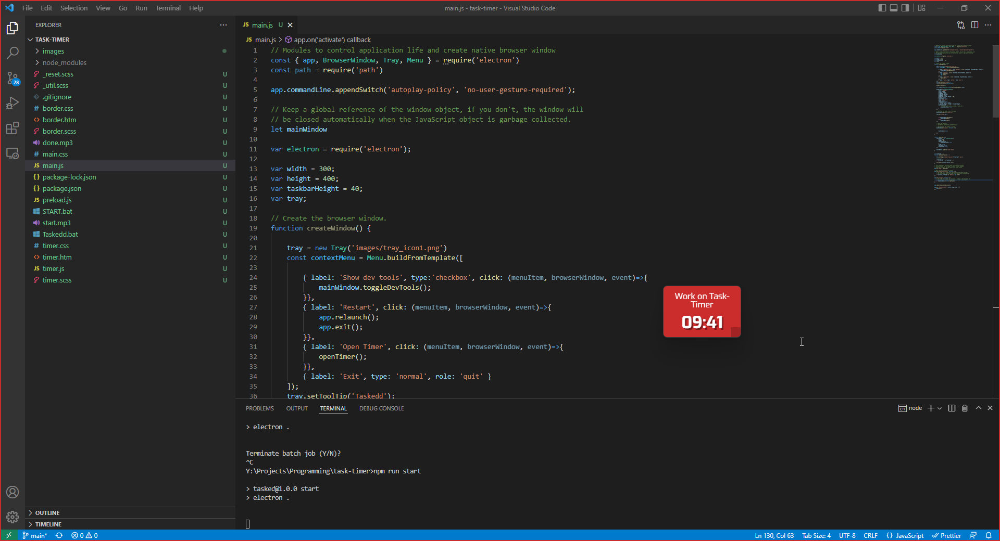

# Task Timer

This is a simple productivity app I made for myself to help keep myself focused. It's a timer that stays open over your screen and reminds you to stay on task. It will also shake and beep and talk to you so you don't forget you're supposed to be being productive and not browsing reddit.

[DOWNLOAD](https://github.com/skeddles/task-timer/releases/tag/v1)

### Features:
- Set timer to any amount in minutes
- See live countdown
- Stays on top of other windows
- Red border shows on your screen to put you in the zone
- Occasional beeps/shakes/talking to keep you focused
- Pause timer and change task name

## Problems

Sometimes when you open it, you just get a white screen. Try waiting a few seconds before clicking start, or minimizing it/clicking on the hover preview in the taskbar. Sorry, electron sucks.

If you have any other problems, please open an issue here on github.

## Other Info

Sorry the exe is so big (110MB). The app was created with javascript and packaged with electron / electron-builder, which makes giant exes. But without electron this wouldn't exist at all, so get over it.

